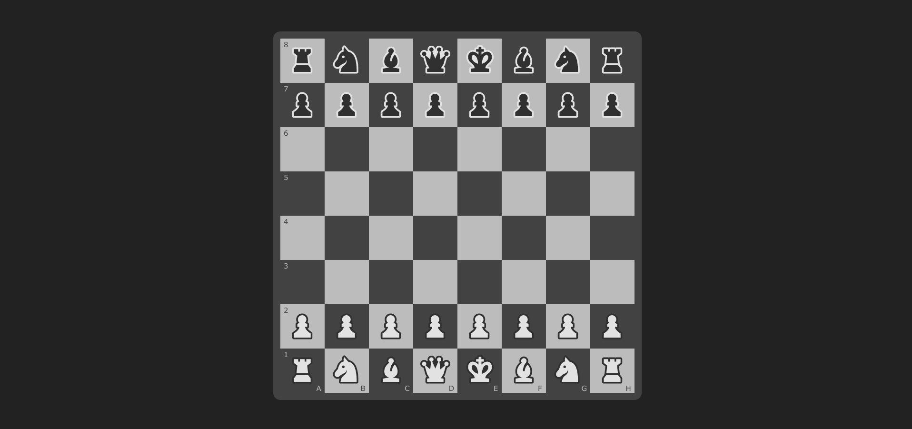

- [Chess Raro Academy](#chess-raro-academy)
  - [Projeto](#projeto)
    - [Objetivos](#objetivos)
  - [Solução](#solução)
    - [Design Figma](#design-figma)
    - [Escolhas de solução](#escolhas-de-solução)
    - [Desafios](#desafios)
    - [Resultado](#resultado)
    - [Sugestão de implementações futuras](#sugestão-de-implementações-futuras)
  - [Instalação](#instalação)

# Chess Raro Academy

## Projeto

Implementação de um tabuleiro de xadrez utilizando apenas HTML e CSS.

### Objetivos

A missão é implementar corretamente um tabuleiro de xadrez usando HTML e CSS nas condições detalhas abaixo. O enunciado completo está [aqui](/.gitlab/enunciado.md). **Condições:**

- [x] Implementar o tabuleiro corretamente: casa à direita dos jogadores (A8 e H1) devem ser brancas;
- [x] Posicionar todas as peças em suas casas corretas;
- [x] Adicionar ao tabuleiro a notação das casas que indicam as coordenadas das linhas e colunas do tabuleiro;
- [x] Implementar toda estrutura e estilização;
- [x] Não utilizar quaisquer frameworks.

## Solução

### Design Figma

Foi utilizado o Figma para criar um pequeno esboço do tabuleiro. Esse esboço realiza pequenas modificações de estilo/cores do tabuleiro e suas peças, mas mantém a proposta do exercício: posição correta das peças, cores das casas e coordenadas. O esboço pode ser visualizado [aqui.](https://www.figma.com/file/HuWUscgfDvOJGwPnptskgy/Xadrez-Raro?node-id=603-896&t=xRLInWsOvmC9OCR4-0)

### Escolhas de solução

Optei pela utilização de _divs_ para estruturar as linhas e as colunas do tabuleiro e declarei classes para seleciona-las no CSS. Agrupei _divs_ que representam as linhas com a classe _row_. Para cada quadrado, a classe _square_ ficou responsável pela configuração de todos os ajustes, acrescentando uma variação de cor: _dark_ ou _light_.

Para centralizar no `<body>` da página foi aplicado _display flex_ e para que as peças ficassem alinhadas em cada _square_ foram aplicadas as propriedades de position _relative_ e _absolute_.

Com o tabuleiro e suas peças implementadas, iniciei o processo de inclusão das coordenadas. Primeiro no HTML, utilizando a tag `` onde as classes foram declaradas da seguinte forma: primeiro uma classe para receber configurações globais, ou seja, configurações para aplicar tanto nas coordenadas horizontais como nas verticais; segundo uma classe para identificar o posicionamento das coordenadas: as coordenadas verticais receberam a classe _left_ e a coordenadas horizontais receberam a classe _bottom_. E por último cada `` recebeu uma classe para identificar a cor do seu texto: claro ou escuro.

### Desafios

Acredito que o principal desafio foi pensar no projeto de forma que ele não ficasse engessado em medidas fixas, e sim que pudesse se ajustar sempre ao centro da página e se expandir ao máximo, aproveitando a tela do usuário.

### Resultado

### Sugestão de implementações futuras

Ao finalizar a implementação de todos os itens necessários do tabuleiro (peças e coordenadas), percebi que as coordenadas não estavam acompanhando o tamanho proporcional das peças quando havia mudança de tamanho de tela. Apesar de já ter realizado alguns ajustes para manter a página responsiva, acredito que há outros pontos a melhorar nesse sentido.

## Instalação

- Clone o repositório e abra o arquivo index.html
